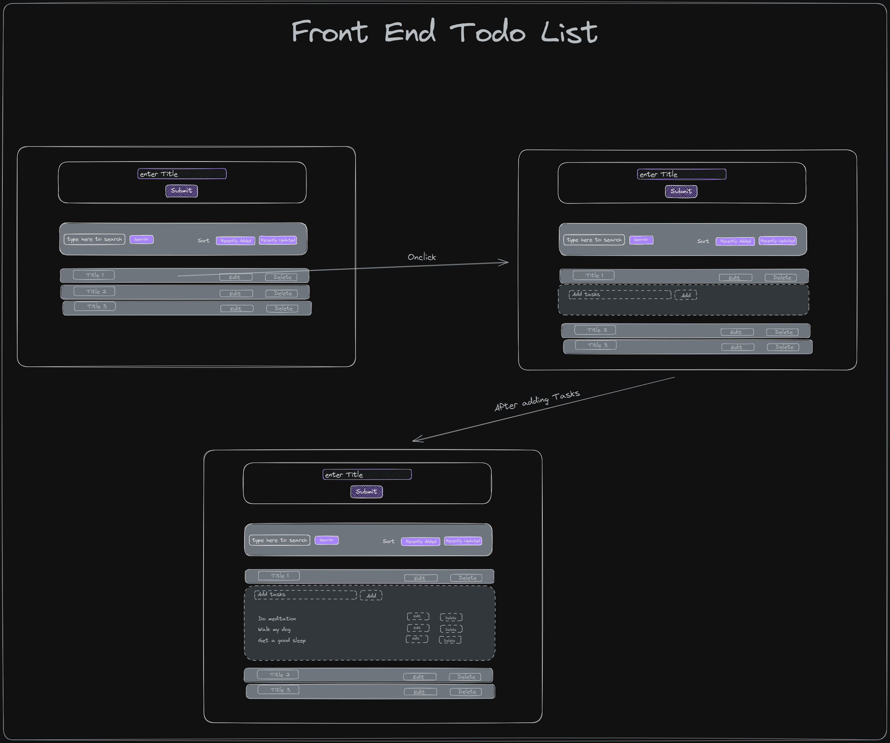

# Auth+Todo List

---

##  Full stack MERN application with authetication 

## Technologies

- Node.js
- Express.js(node.js Framework)
- Postman
- Mongoose(will connect to MongoDB)
- JWT for authentication
- Other required packages.

## Planning

### Frontend planning

### Backend planning

### Screenshots

---

### Learnings

- Learned the CRUD application in backend and understood the architecture of node.js
- Understood how to use react and use it with backend.
- overall gave me the confidence to do full stack project

